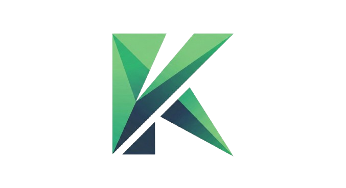

# KATA

### The Way of the Keyboard

---

## Hola!

- Estudio Ciencias de la Computacion
- Me gusta la terminal
- Me gusta crear las herramientas que yo mismo uso

---

## Mi dia a dia en la terminal

- **neovim** - Editor de codigo
- **lazygit** / **lazydocker** / **lazysql** - TUIs para git, docker, SQL
- **gh dash** - Dashboard de GitHub
- **ripgrep** - Buscar en archivos (grep pero rapido)
- **ffmpeg** - Convertir audio/video
- **pandoc** - Convertir documentos

Todas open source. Las TUIs me inspiraron a hacer la mia.

---

## Que es KATA?

En artes marciales, una **Kata (型)** es una secuencia de
movimientos que se practica hasta que se vuelve **instinto**.

> Practicar escribir codigo real hasta que
> tus dedos lo hagan sin pensar.

No es sobre escribir rapido. Es sobre escribir **bien**.

---

## Que puede hacer?

- Practicar con sintaxis real de **Go, Rust, Python, C++, JS**
- Tambien con texto en **español, ingles, frances, aleman**
- 6 colorschemes
- **Heatmap** de teclado para ver tus teclas debiles
- Sistema inteligente que **adapta** las lecciones a ti

---

## Demo

---

## Un poquito de ciencia

Investigue antes de programar. Encontre 3 ideas clave:

1. **Repeticion Espaciada** - Lo que fallas, se repite mas
2. **N-Grams** - Patrones reales, no letras sueltas
3. **Flow** - Feedback sutil, sin romper concentracion

---

## Repeticion Espaciada (SM-2)

El mismo algoritmo que usa **Anki** para flashcards.

- Si fallas `{` o `[`, aparecen **mas seguido**
- Lo que ya dominas se muestra **menos**

```
Accuracy alta  ->  intervalo crece (1 -> 6 -> 15 dias)
Accuracy baja  ->  se resetea a 1 dia
```

El programa _aprende_ que te cuesta.

---

## N-Grams: practicar lo real

Para escribir rapido, no pensar por letra sino en **chunks** (secuencias completas).

En vez de `k j a s d f l ;` practicas:

```go
func main() {
if err != nil {
fmt.Println("hello")
```

---

## Flow: feedback sin interrumpir

- Letra correcta = **verde**
- Letra incorrecta = **rojo** (sutil, sin parpadeos locos)
- Go es rapido, asi que la respuesta es **instantanea**
- **Modo Zen**: solo tu y el texto

Si el feedback es muy agresivo, te frustra.
Si no hay feedback, no aprendes. El punto medio es clave.

---

## Como esta hecho

```
kata/
├── cmd/kata/        # Entry point
├── internal/
│   ├── cli/         # Argumentos CLI
│   └── app/         # Interfaz (Bubble Tea)
└── pkg/
    ├── engine/      # Motor de tipeo
    ├── generator/   # Generador de lecciones
    ├── stats/       # SQLite + SRS
    ├── themes/      # Temas de colores
    ├── keyboard/    # Heatmap
    └── export/      # JSON/CSV
```

---

## La historia de Charmbracelet

En **2019**, **Toby Padilla** (ex-Apple) y **Christian Rocha**
(ex-Zenly/Snap) tuvieron una idea:

> _"make the command line glamorous."_

Fundaron **Charm**

---

## Como crecio Charm

Empezaron con **Glamour** y **Glow**: Cute Markdown renderer en la terminal.

Pero necesitaban apps **interactivas**...

Asi nacio **Bubble Tea**: framework TUI basado en la arquitectura ELM.
Y **Lipgloss** para los estilos: basicamente CSS para la terminal.

---

## El ecosistema Charm hoy

| Herramienta    | Que hace                          |
| -------------- | --------------------------------- |
| **Bubble Tea** | Framework TUI (patron ELM)        |
| **Lipgloss**   | Estilos y layouts                 |
| **Bubbles**    | Componentes (inputs, spinners...) |
| **Glow**       | Visor de Markdown                 |
| **Soft Serve** | Servidor Git con TUI              |
| **VHS**        | Grabar demos como GIF             |
| **Gum**        | UI para shell scripts             |

**+18,000 apps** hechas con Bubble Tea. Todo open source.

---

## Como use Charm en KATA

El patron ELM es muy simple. Toda la app es un ciclo:

```go
type model struct {
    screen   screenType
    engine   *engine.Engine
    theme    themes.Theme
}

func (m model) Update(msg tea.Msg) (tea.Model, tea.Cmd)
func (m model) View() string
```

**Model** (estado) -> **Update** (eventos) -> **View** (renderizar)

---

## SQLite puro en Go

```go
import "modernc.org/sqlite"
```

- Implementacion de SQLite **100% en Go**, sin CGO
- Eso significa: compila en cualquier lado, sin dependencias de C
- Guarda tus sesiones, estadisticas y datos del SRS
- Todo local en `~/.kata/kata.db`

---

## Las herramientas libres que use

| Herramienta          | Para que                          |
| -------------------- | --------------------------------- |
| **Go**               | Lenguaje. Rapido, un solo binario |
| **Bubble Tea**       | Framework TUI                     |
| **Lipgloss**         | Estilos en terminal               |
| **SQLite (pure Go)** | Base de datos local               |
| **Nix**              | Builds reproducibles              |
| **Marp**             | Esta presentacion!                |

Todo free software. Todo disponible para ustedes hoy.

---

## El dia de los 16 commits

Dividi `main.go` en archivos, extraje paquetes,
implemente **todo** el SRS, añadi tests e indexes a la base de datos.

**16 commits en un dia.** A veces la inspiracion llega.

---

## The worst moment...

Mi primera vez probando el vide-coding con Codex y me elimina el repo.

---

## Que aprendi

- **Go es ideal para CLIs**: un binario, cross-platform, rapido
- **Charm hizo posible** que mi terminal app se vea bien
- **Investigar antes de codear** vale mucho la pena
- **Dogfooding funciona**: si tu lo usas, lo mejoras de verdad
- **SQLite puro** te salva de las pesadillas de CGO

---

## Que aprendi (sobre open source)

- **No necesitas permiso** para crear herramientas, arriba el free-software
- **Compartir tu trabajo** trae sorpresas (hola, Grazen0)

---

## Quieren probarlo?

```bash
git clone https://github.com/stiffis/kata.git
cd kata && ./install.sh
kata
```

O con Nix: `nix build`

---

# Gracias!

> _"Fortune favors the bold."_


